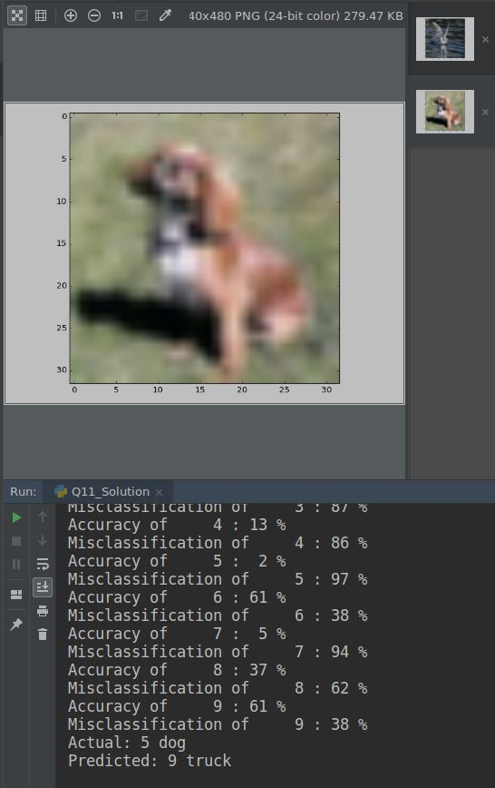

## Report for Exam 1
### By Xiaochi (George) Li

*All the "we" mentioned in the report is just a idiom in academic writing, this report is completed by myself*

## Question 1
After fixing all the bugs and errors. The overall accuracy of the Neural Network is around 44%.   
Setting: Epoch=10, learning rate=0.1,momentum = 0.9, hidden size=30.  
We will fine tune the hyper-parameters in the future.  

## Question 2
Time for running on CPU is 8.5 sec per epoch, however using cuda didn't speed up the training significantly(reduce 0.3 sec
per epoch).  
Overall accuracy is 44% with the same hyper-parameter.

## Question 3 
The program is set up to perform mini-batch gradient descent. Because during each iteration of the training,
the program takes an input which has shape batch_size * input_size. So we can know that it's a mini-batch gradient descent.

## Question 4
We modified the Neural Network we constructed in Q2, and used one hidden layer with 60 neurons.   
The structure is 3072-60-10,and the total number of parameters is 60x3072+60x1 + 10x60+10x1 = 184,990  
In Q4b, we tried to make the neural network deeper to 3 hidden layers, the structure is 3072-59-40-20-10, the total number of 
parameter is 184737.

|Name|Structure|Accuracy|Average time per epoch|
|----|----|----|----|
|Q4a|3072-60-10|45%|8.722|
|Q4b|3072-59-40-20-10|23%|8.557|

It can be easily seen that more layers will harm the performance.

## Question 5
We copied Q4a to Q5a as the first optimizer option. And tried several optimizer as the table shows.   
We used learning_rate = 0.1, momentum = 0.9 as hyper-parameter.

|Name|Accuracy|Average time per epoch|Optimizer|
|----|----|----|----|
|Q5a|45%|8.38|optim.SGD(net.parameters(), lr=learning_rate, momentum=momentum)|
|Q5b|37%|8.31|optim.SGD(net.parameters(), lr=learning_rate)|
|Q5c|21%|8.25|optim.RMSprop(net.parameters(), lr=learning_rate)|
|Q5d|19%|8.28|optim.RMSprop(net.parameters(), lr=learning_rate, momentum=momentum)|
|Q5e|19%|8.40|optim.Adam(net.parameters(),lr=learning_rate)|

Conclusion: Stochastic Gradient Descent with momentum is the best optimizer we have. 

## Question 6
We copied Q4a to Q6a as the first transfer function option.  

|Name|Transfer function|Accuracy|Average time per epoch|
|----|----|----|----|
|Q6a|ReLU|45%|8.46|
|Q6b|Sigmoid|36%|8.34|
|Q6c|Leaky ReLU|45%|8.45|
|Q6d|PReLU|45%|8.35|
|Q6e|Tanh|42%|8.29|

Conclusion: ReLU based transfer function works better than Sigmoid and Tanh as expected.  
The reason is that ReLU preserve a bigger gradient when the input is far from zero. Thus prevented gradient shrinkage.

## Question 7

**IMPORTANT: Please put Q7a_Solution.py and Q7b_Solution.py in the same folder and run Q7b_Solution.py**

According professor's explanation on Oct.29, my understanding is that we need to calculate the average gradient for 
each input (picture) and save them into a csv file.   
Then, we do the same process several times to get a trace of average gradient, and calculate the mean and 
standard deviation of the trace to find out the top 10 input(pictures) that has largest influence on the weight of 
neural network.

To implement this idea, we need to do the following steps:
Firstly, encapsulate the training part into a function for further use(See **Q7a_Solution.py**).
* Turn on the gradient record for the input
```python
images, labels = Variable(images.view(-1, input_size).cuda(), requires_grad=True), Variable(labels.cuda())
```
* Calculate the average gradient and return it to higher lever function, also save it into a CSV file.
```python
    input_gradient_trace = torch.cat(input_gradient_trace, 0)  # concatenate to a tensor

    import numpy as np

    input_gradient_trace = input_gradient_trace.data.cpu().numpy()  # transform to numpy array
    print("Size of gradient trace:", input_gradient_trace.shape)
    avg_grad = np.average(input_gradient_trace, 1).reshape(1, -1)
    print("Size of average gradient trace:", avg_grad.shape)
    with open(file_name, "ab") as trace_file:
        print("Saving to", file_name)
        np.savetxt(trace_file, avg_grad, delimiter=',')
    return avg_grad
```

Then, construct a higher level function(**Q7b_Solution.py**) which receive the average gradient from Q7a, put them together 
and calcualte the mean and standard deviation for each input(picture).

Implemented by the following code in **Q7b_Solution.py**:
```python
for i in range(trail_length):
    file_name = "trace" + str(i) + ".csv"
    if os.path.isfile(file_name):
        os.remove(file_name)  # if exist the file, then remove it
    trail_list.append(helper(file_name))  # call the Neural Network and get average gradient and save csv file

trail = np.concatenate(trail_list, axis=0)
print("The shape of trail matrix:", trail.shape)
trail_avg = np.average(trail, axis=0)
trail_std = np.std(trail, axis=0)

max_ten_avg = trail_avg.argsort(kind='quicksort')[-10:][::-1]
max_ten_std = trail_std.argsort(kind='quicksort')[-10:][::-1]
```

And we can get the result in the terminal like:
```text
The top ten input(Pictures) that has largest average of gradient:
 [46394 41753 44118 40476 41680 44816 44976 49283 42488 34949]
The top ten input(Pictures) that has largest standard deviation of gradient:
 [40713 43152 42551 41193 49853 45318 44733 47880 46843 48453]
```

## Question 8
We copied Q4a to Q8a as no drop out option. And we modified the drop rate between hidden layer and output layer.

|Name|Drop out rate|Accuracy|Average time per epoch|
|----|----|----|----|
|Q8a|0%|45%|8.14|
|Q8a|0%|50%|8.10|
|Q8b|20%|42%|8.20|
|Q8c|50%(10epoch)|38%|8.47|
|Q8d|50%(50epoch)|41%|8.31|

We can see that using drop nodes will harm performance if we did not increase training epoch number.  
Dropout nodes is a method to do regularization, and can prevent over fitting.  
However, it will take more time to train the network because the effective neurons in each epoch is reduced.  

## Question 9
We copied Q4a to Q9a as batch option. And we modified the batch size.

|Name|Batch size|Accuracy|Average time per epoch|
|----|----|----|----|
|Q9a|10000(Batch)|45%|8.35|
|Q9b|1(SGD)|2%|49.79|
|Q9c|64(Mini batch)|10%|9.00|

Using SGD will significantly slow down the speed,   
SGD and Mini batch will harm the performance of the network.

## Question 10
We copied Q4a to Q10 and modified the *Accuracy by Category* Part.  
Adding the following code will generate the confusion matrix:

```python
from sklearn.metrics import confusion_matrix
predicted_np = predicted.data.cpu().numpy()
labels_np = labels.data.cpu().numpy()
confusion_matrix = confusion_matrix(labels_np, predicted_np)
print(confusion_matrix)
```
This is the confusion matrix we may see in the terminal:

```text
[[517  63  71  19  29  32  31  65 143  84]
 [ 38 574  17  23  17  19  41  41  60 155]
 [ 91  33 319  67 105  80 176  95  31  21]
 [ 37  41  86 271  39 186 148  67  44  62]
 [ 66  27 138  53 301  48 162 114  31  18]
 [ 21  43  79 148  48 371 115  90  27  31]
 [ 12  31  82  78  90  76 598  30   7  36]
 [ 25  35  54  60  71  67  65 493  25  59]
 [109  92  25  23  12  27  10  16 609  84]
 [ 44 196  17  24  11  33  39  44  77 545]]
```

By definition a confusion matrix C is such that C(i,j) 
is equal to the number of observations known to be in group i 
but predicted to be in group j.

We can get the overall accuracy and misclassification rate by the following code:

```python
correct = 0
total = 0
for images, labels in test_loader:
    images, labels = Variable(images.view(-1, input_size).cuda()), Variable(labels.cuda())
    outputs = net(images)
    _, predicted = torch.max(outputs.data, 1)
    total += labels.size(0)
    correct += (predicted == labels)

over_all_accuracy = correct.sum().item() / total
print('Accuracy of the network on the 10000 test images: %d %%' % (100 * over_all_accuracy))
print('Misclassification of the network on the 10000 test images: %d %%' % (100 * (1 - over_all_accuracy)))
```

We can get the accuracy and misclassification rate of each category by the following code:

```python
class_correct = list(0. for i in range(10))
class_total = list(0. for i in range(10))

images, labels = data
images, labels = Variable(images.view(-1, input_size).cuda()), Variable(labels.cuda())
outputs = net(images)
_, predicted = torch.max(outputs.data, 1)
c = (predicted == labels)

for i in range(c.size()[0]):
    label = labels[i].item()
    class_correct[label] += c[i].item()
    class_total[label] += 1

for i in range(10):
    accuracy = class_correct[i] / class_total[i]
    print('Accuracy of %5s : %2d %%' % (classes[i], 100 * accuracy))
    print('Misclassification of %5s : %2d %%' % (classes[i], 100 * (1 - accuracy)))
```

## Question 11
We copied Q10 to Q11 and make some modification with it.   
We can get a random sample from the training set, visualize it and compare the true label and predicted label 
with the following code:
(part of the code comes from https://pytorch.org/tutorials/beginner/blitz/cifar10_tutorial.html#sphx-glr-beginner-blitz-cifar10-tutorial-py)  

We can get something like:



```python
# Visualize network response for an arbitrary input
from torch.utils.data import RandomSampler
import matplotlib.pyplot as plt
import numpy as np

# functions to show an image
def imshow(img):
    img = img / 2 + 0.5     # unnormalize
    npimg = img.numpy()
    plt.imshow(np.transpose(npimg, (1, 2, 0)))
    plt.show()
    
label_name = ('airplane', 'automobile', 'bird', 'cat', 'deer', 'dog', 'frog', 'horse', 'ship', 'truck')

data_loader = torch.utils.data.DataLoader(train_set, batch_size=1, shuffle=True)
dataiter = iter(data_loader)
image, label = dataiter.next()
input = Variable(image.view(-1, input_size).cuda())
outputs = net(input)
_, predicted = torch.max(outputs.data, 1)

# show images
imshow(torchvision.utils.make_grid(image))
# print labels
print("Actual:", label.item(), label_name[label.item()])
print("Predicted:", predicted.item(), label_name[predicted.item()])
```

