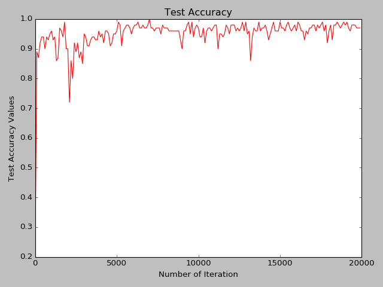

## Report for Exam 2
### By Xiaochi (George) Li

*All the "we" mentioned in the report is just a idiom in academic writing, this report is completed by myself*

## Question 1-5
Just follow the instructions.  
There are two possible bugs:

1. When download the files from Github repo and upload it to our VM, there may be encoding issue.  
Fix: Copy the file from the repo 
2. In step 3, the path of BUILD should also be changed   
Fix: Change it to the caffe root on this VM

## Question 6
The loss decrease with the number of iteration and the Test Accuracy increase with the number of accuracy.   
It means the training is effective.


## Question 7
We modified the original ```train_minst.py ``` to let the program visualize the kernels in convolution layer 2.   
The kernels looks like parts of a number, like a vertical line ,part of a circle, or a corner.  
These may be helpful in identifying the hand writing numbers.  


## Question 8
The performance of Convolution network is much better that the multilayer networks in Exam 1

## Question 9

|Mini batch size|Average Time|Total Time 20k epoch)|
|----|----|----|
|32|0.00290|58.04|
|64|0.00346|69.21|
|128|0.00463|92.61|
|256|0.00745|149.15|
|512|0.0128|257.7|

After making the size of mini batch 512, the average time per epoch slowed down by 4.44 times.

|Batch size = 32|Batch size = 512|
|----|----|
|||

We can see that the advantage of a larger batch size is that the fluctuation of the loss function is smaller.
Which means the algorithm converges in a smaller epoch. However the disadvantage is that it will cost more time.

## Question 10
Add the dropout layer in ```lenet_train_test.prototxt```:
```text
layer {
  name: "drop"
  type: "Dropout"
  bottom: "ip1"
  top: "ip1"
  dropout_param {
    dropout_ratio: 0.5
  }
}
```
The accuracy of test after using drop out is still 1.00, so there is no difference.

|No dropout|Dropout=0.5|
|----|----|
|||

## Question 11

|Layer|Parameter Size|Data size after this layer|
|----|----|----|
|Conv1|

## Question 12
Add [Adam optimizer](http://caffe.berkeleyvision.org/tutorial/solver.html) in ```lenet_solver.prototxt```

```text
type:"Adam"
```

|Optimizer|Loss|Accuracy|
|----|----|----|
|SGD|||
|Adam|||

No big difference.

