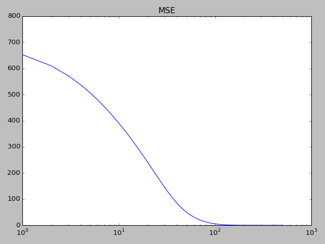
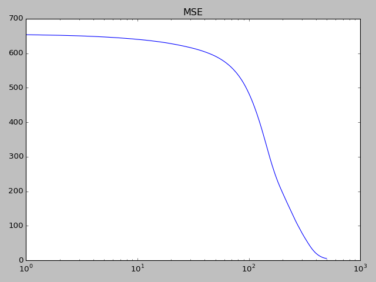

## Report for homework 6
Author: Xiaochi Li

## Part 1 Pytorch Basics
### Exercise 1
#### Q1:  
*Rewrite the "2_tensor_pytorch.py" file in Neural Network Design Book,
Chapter 11 notation (Check the Summary Page) and find out
what are the differences. Explain your findings.*

The original one use chain rule directly, and the edited one calculate sensitivity first.
While they have the same effect, calculate the sensitivity by recursion is clearer mathematically.

#### Q2
*Use the time package of python and test it on "1_Numpy.py" code and save the 
running time. Change the dtype to torch tensor save the running time as well. 
Comapre the timing results. Explain your findings.*

The running time of the original code is about 0.63s, after changing the dtype to torch.tensor, the running time is 
about 0.52s. The reason may be pytorch has some more efficient design about calculating matrix.

#### Q3
*Q3: Keep the data size same and change the number of epochs for Q2.
Compare the timing results. Explain your findings.*

|Number of epoch|Time|
|----|----|
|500|0.60|
|1000|1.13|
|1500|1.67|
|2000|2.32|

Time increases when the number of epoch increase, the relationship of increase between these two factors is linear.
Reason: when the running time for each epoch is same, the more epochs we have, the more total running time will be.

#### Q4
*Q4: Increase the data size and keep the number of epochs for Q2 (Hints: Big number for epochs).
Comapre the timing results. Explain your findings.*

When we double the data size (``` batch_size=128 ```), the running time increase to 4.30s. 
Reason: When the number of epoch is same, increase data size will lead to more computation.

#### Q5
*Keep the data size big and keep the number of epochs big. Change the dtype to 
torch tensor cuda and compare it with numpy.
Compare the timing results. Explain your findings.*

10000 epoch with cuda: 18.266, without cuda is 10.85.  
I think the running time on CPU is shorter because the data is not complex, and it takes some time to transfer the data
to GPU which slow down the overall speed.

### Exercise 2
*Q1: Modify  the "1_Numpy.py" file and change the dtype to torch float tensor.
Save the vale of the performance and  plot the followings:*

i. Performance index with respect to epochs.


ii. w1 grad 


iii. w2 grad 


iv. Check your results. Explain each of your plots.

The Gradient Descent algorithm converges after 10 epochs.   
We can observe that the MSE, gradient of W1 and W2 is close to zero after 10 epochs. Which means the gradient descent
has found the optimum.

## Part 2 NN Module
### Exercise 1
#### Q1
*Q1: Modify "1_nn_pytorch.py" and save the performance.
Plot the performance index with respect to epochs.*

```text
See 1_nn_pytorch_edited.py
```



#### Q2
*Q2: Create a 4 layer network (for Q1) with the following sizes (1-100-50-20-1). 
Train the network and check the performance index.*

```text
See 1_nn_pytorch_edited2.py
```




#### Q3
*Compare the results of Q1 and Q2.*

It takes more epoch for the GD algorithm to converge in Q2 when the neural network has more layers.

#### Q5
*Find all the parameters of the network and write a for loop to print 
the size and name of the parameters.*

```text
See  1_nn_pytorch_edited3.py
```

[named_parameters](https://pytorch.org/docs/stable/nn.html#torch.nn.Module.named_parameters)

```python
for k, v in model.named_parameters():
    print(k, v.shape)
```

#### Q6
*Save the gradient values for each weight in the csv file.*

Implementation: 
```python
param_dict = {}

for k, v in model.named_parameters():
    print(k, v.shape)
    param_dict[k] = []


for index in range(max_epoch):

    a = model(p)
    loss = performance_index(a, t)
    print(index, loss.item())
    loss_list.append(loss.item())

    model.zero_grad()
    loss.backward()

    for k, v in model.named_parameters():
        param_dict[k].append(v)

    for param in model.parameters():
        param.data -= learning_rate * param.grad

import numpy as np
for k,v in param_dict.items():
    v = torch.cat(v,0).detach().numpy()
    with open(str(k) + ".csv", "ab") as grad_file:
        print("saving:", k, "Shape:", v.shape)
        np.savetxt(grad_file, v, delimiter=",")
```
Terminal:
```text
saving: 2.bias Shape: (10000,)
saving: 2.weight Shape: (10000, 100)
saving: 0.weight Shape: (100000, 1000)
saving: 0.bias Shape: (100000,)
```

#### Q7
*If you increase epochs for Q6 what changes do you see?*

The size of trace of gradient increased, and the gradient approach zero.

### Exercise 2
#### Q1
*Try Ada delta optimizer for "3_nn_optim.py" file and use different values 
for rho and eps.Do a little search and check and find out what are the effects 
of each parameter.*

[Adadelta](http://ruder.io/optimizing-gradient-descent/index.html#adadelta) is
an extension of [Adagrad](http://ruder.io/optimizing-gradient-descent/index.html#adagrad)
rho is similar to momentum, and it represent the weight on the running average.
And eps is a smoothing term that avoid division by zero.

#### Q2
*Q2:  Try SGD optimizer and use different values for momentum and weight decay. 
Do a little search and check and find out what are the effects of each parameter.*

[Momentum](http://ruder.io/optimizing-gradient-descent/index.html#momentum) is a method
that helps accelerate SGD in the relevant direction. It's like push a ball down a 
hill. The ball accumulates momentum as it rolls downhill, becoming faster and faster
on the way. As a result, we gain faster convergence and reduced oscillation.

[weight decay](https://bbabenko.github.io/weight-decay/) is similar to L2 regularization that
directly deduct some value from gradient as a penalty of big weight. It can avoid overfitting.


#### Q3
*Try Adam optimizer and find the effect of beta . 
Do a little search and check and find out what are the effects of each parameter.*

[Adam(Adaptive Moment Estimation)](http://ruder.io/optimizing-gradient-descent/index.html#adam)
is another method that computes adaptive learning rates for each parameter. In addition 
to storing an exponentiially decaying average of past squared gradients v_t like Adadelta,
Adam also keep an exponentially decaying average of past gradients m_t similar to momnetum,

Whereas momentum can be seen as a ball running down a slope, Adam behaves like a heavy ball
with friction, which thus prefers flat minima in the error surface.

beta_1(default 0.9) is the weight for average of past gradients m_t-1, and beta_2(default 0.999) is the weight for 
average of past squared gradients v_t-1. 

### Exercise 3
#### Q1
*Modify "3_nn_optim.py" in order to find out the cuda capabilities of the system.*
After modifying the batch size, we found the 

#### Q2
*Train a 2 layer mlp network using pytorch to approximate the the following function 
t= sin(p)  ; -3< p < 3*

```text
See 3_nn_optim_edited2.py
```

.png)

#### Q3
*Redo the Q2 with 6 layer network.*

```text
See 3_nn_optim_edited3.py
```

_2.png)